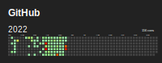
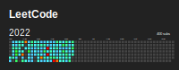

### Hi there 👋

<!--
**MilkyGreen/MilkyGreen** is a ✨ _special_ ✨ repository because its `README.md` (this file) appears on your GitHub profile.

Here are some ideas to get you started:

- 🔭 I’m currently working on ...
- 🌱 I’m currently learning ...
- 👯 I’m looking to collaborate on ...
- 🤔 I’m looking for help with ...
- 💬 Ask me about ...
- 📫 How to reach me: ...
- 😄 Pronouns: ...
- ⚡ Fun fact: ...
-->

- Familiar with Java, used Go , C and JS.
- Interested in: distributed system, algorithm, blockchain, compiler and interpreter.
- Solving a algorithm problem per day(almost) at [leetcode](https://leetcode-cn.com/u/milkygreen/).
- Working at an aowesome low-code company in China.
- Learning English everyday.

